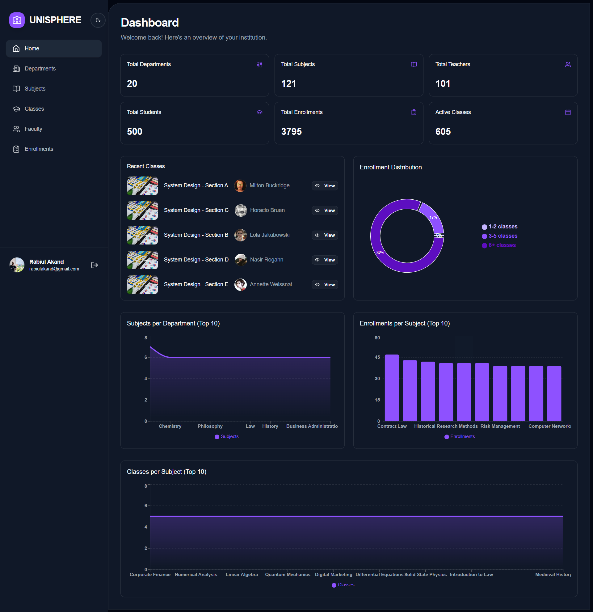

# UniSphere

> A comprehensive University Management System for streamlining academic administration, class scheduling, and student enrollment.



🔗 **Live Demo:** [Link to Live Demo](https://unisphere-demo.com) _(Placeholder)_

## 📋 Project Overview

**UniSphere** is a modern, full-stack web application designed to digitize and simplify university operations. It provides a robust platform for administrators to manage departments and subjects, teachers to schedule and conduct classes, and students to easily enroll in courses.

Built with performance and scalability in mind, UniSphere leverages a React frontend with a Node.js/Express backend, ensuring a seamless user experience across devices.

## ✨ Key Features

- **Role-Based Access Control (RBAC):** Secure access for Admins, Teachers, and Students with specific permissions.
- **Department & Subject Management:** Admins can organize academic structures efficiently.
- **Class Scheduling & Management:** Teachers can create classes, manage capacity, and track status.
- **Student Enrollment System:** Streamlined process for students to browse and enroll in available classes & enrollment confirmation email.
- **Interactive Dashboard:** Visual analytics using charts to track enrollments, subjects, and class distribution.
- **Advanced Search & Filtering:** Find departments, subjects, or classes instantly with server-side filtering.
- **Dark/Light Mode:** Fully responsive UI with theme persistence.
- **Secure Authentication:** JWT-based auth with password encryption and reset functionality.
- **Security Protections:** Ensure multiple security layers so the API can’t be easily abused by bots or attackers including rate limiting, bot detection, and DDoS protection.
- **Responsive Design:** Optimized for desktops, tablets, and mobile devices.

## 🛠️ Tech Stack

### Frontend

- **Library:** [React](https://react.dev/)
- **Language:** [TypeScript](https://www.typescriptlang.org/)
- **Styling:** [Tailwind CSS v4](https://tailwindcss.com/)
- **UI Library:** [Shadcn UI](https://ui.shadcn.com/) + [Lucide React](https://lucide.dev/)
- **State Management:** React Context + [TanStack Query](https://tanstack.com/query/latest)
- **Form Handling:** React Hook Form + Zod
- **Routing:** React Router v7
- **Charts:** Recharts

### Backend

- **Runtime:** [Node.js](https://nodejs.org/)
- **Framework:** [Express.js](https://expressjs.com/)
- **Language:** TypeScript
- **ORM:** [Drizzle ORM](https://orm.drizzle.team/)
- **Security:** [Arcjet](https://arcjet.com/) (Bot detection & security)
- **Validation:** Zod

### Database & Storage

- **Database:** PostgreSQL with NeonDB
- **File Storage:** Cloudinary (for avatars and banners)

## 🏗️ Architecture Overview

The application follows a standard **Client-Server architecture**.

- **Frontend:** A Single Page Application (SPA) that consumes RESTful APIs. It utilizes Lazy Loading for performance optimization.
- **Backend:** A REST API layer that handles business logic, communicates with the PostgreSQL database via Drizzle ORM, and enforces security policies.

## Installation & Setup Guide

### Prerequisites

- Node.js (v18 or higher)
- PostgreSQL installed and running
- Exceptional package manager (npm, pnpm, yarn)

### 1. Clone the repository

```bash
git clone https://github.com/rabiul7772/uni-sphere.git
cd uni-sphere
```

### 2. Frontend Setup

```bash
cd frontend
npm install
```

### 3. Backend Setup

```bash
cd ../backend
npm install
```

### 4. Database Setup

Ensure your PostgreSQL database is running. Then run migrations:

```bash
# In ./backend directory
npm run db:generate
npm run db:migrate
```

### 5. Environment Variables

Create a `.env` file in **both** `frontend` and `backend` directories.

#### **Backend (`backend/.env`)**

```env
PORT=5000
DATABASE_URL="your_database_url"
JWT_SECRET="your_super_secret_jwt_key"
FRONTEND_URL="http://localhost:5173"
RESEND_API_KEY="your_resend_api_key" # For email services
ARCJET_KEY="your_arcjet_key"     # For security
```

#### **Frontend (`frontend/.env`)**

```env
VITE_BACKEND_BASE_URL="http://localhost:5000/api"
VITE_CLOUDINARY_CLOUD_NAME="your_cloud_name"
VITE_CLOUDINARY_UPLOAD_PRESET="your_upload_preset"
```

### 6. Run Development Servers

**Backend:**

```bash
# In ./backend
npm run dev
```

**Frontend:**

```bash
# In ./frontend
npm run dev
```

Visit `http://localhost:5173` to view the application.

## 📦 Folder Structure

```
unisphere/
├── backend/
│   ├── src/
│   │   ├── controllers/   # Request handlers
│   │   ├── db/            # Database schema & config
│   │   ├── middlewares/   # Auth & security middleware
│   │   ├── routes/        # API route definitions
│   │   └── utils/         # Helper functions working
│   └── package.json
│
├── frontend/
│   ├── src/
│   │   ├── components/    # Reusable UI components
│   │   ├── contexts/      # Global state (Theme, Auth)
│   │   ├── features/      # Feature-based modules
│   │   ├── hooks/         # Custom React hooks
│   │   ├── pages/         # Page views
│   │   ├── services/      # API calls
│   │   └── types/         # TypeScript definitions
│   └── package.json
│
└── README.md
```

## 🔮 Future Improvements

- [ ] **Real-time Notifications:** Implement Socket.io for live updates on enrollment.
- [ ] **Attendance Tracking:** Allow teachers to mark daily attendance.
- [ ] **Grade System:** Grading module for assignments and exams.
- [ ] **Calendar Integration:** Sync class schedules with Google/Outlook calendars.

## ✍️ Author

**Rabiul**

- GitHub: [@rabiul7772](https://github.com/rabiul7772)

---

_Built with ❤️ for better education management._
